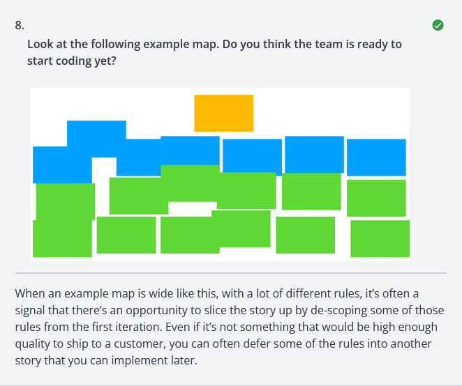

---
tags:
  - test 
  - cookiecutter 
  - cucumber 
  - python 
---
# behave (cucumber tests)

## gherkin file

- `features/file.feature`

```gherkin
-8<- "features/file.feature"
```

## locally

```sh
behave
```

```sh
Feature: Verify log files # features/file.feature:1
  As a developer
  I want to ensure the logs contain specific content
  So that I can confirm the application is running correctly
  Scenario Outline: Check log file file1 for expected content 1 -- @1.1   # features/file.feature:13
    Given I have a log file named "file1"                                 # features/steps/file_steps.py:8
    When I check the file for "expected content 1"                        # features/steps/file_steps.py:13
    Then the file should contain "expected content 1"                     # features/steps/file_steps.py:19

  Scenario Outline: Check log file file2 for expected content 2 -- @1.2   # features/file.feature:14
    Given I have a log file named "file2"                                 # features/steps/file_steps.py:8
    When I check the file for "expected content 2"                        # features/steps/file_steps.py:13
    Then the file should contain "expected content 2"                     # features/steps/file_steps.py:19

1 feature passed, 0 failed, 0 skipped
2 scenarios passed, 0 failed, 0 skipped
6 steps passed, 0 failed, 0 skipped, 0 undefined
Took 0m0.002s
```

## remotely

- `.github/behave.yml`

```yml
name: Run tests

on: [push, pull_request]

jobs:
  test:
    runs-on: ubuntu-latest
    steps:
    - uses: actions/checkout@v2
    - name: Setup Python
      uses: actions/setup-python@v2
      with:
        python-version: '3.x'
    - name: Install dependencies
      run: |
        python -m pip install --upgrade pip
        pip install -r requirements.txt
    - name: Run tests
      env:
        SKIP_TESTS: ${{ env.SKIP_TESTS }}
      run: |
        if [ -z "$SKIP_TESTS" ]; then
          behave features/file.feature
          # behave -c 1
        else
          echo "Tests skipped due to SKIP_TESTS environment variable."
        fi
```

## cookiecutter for rules/

- when features get bloated with rules I find this useful
- bust out rules into individual `rule/` folders with individual feature files
- <https://cucumber.io/docs/gherkin/reference/?sbsearch=Rule#rule>

The purpose of the Rule keyword is to represent one business rule that should be implemented. It provides additional information for a feature. A Rule is used to group together several scenarios that belong to this business rule. A Rule should contain

```sh
cookiecutter rule
```

- if it is not installed

```sh
cookiecutter https://github.com/shane0/workflow --directory rule
```

## three amigos

- the three amigos are from business dev & test
- map it out


- good to go


- slice up the story

- someone is missing or not answering questions

- finish the story

