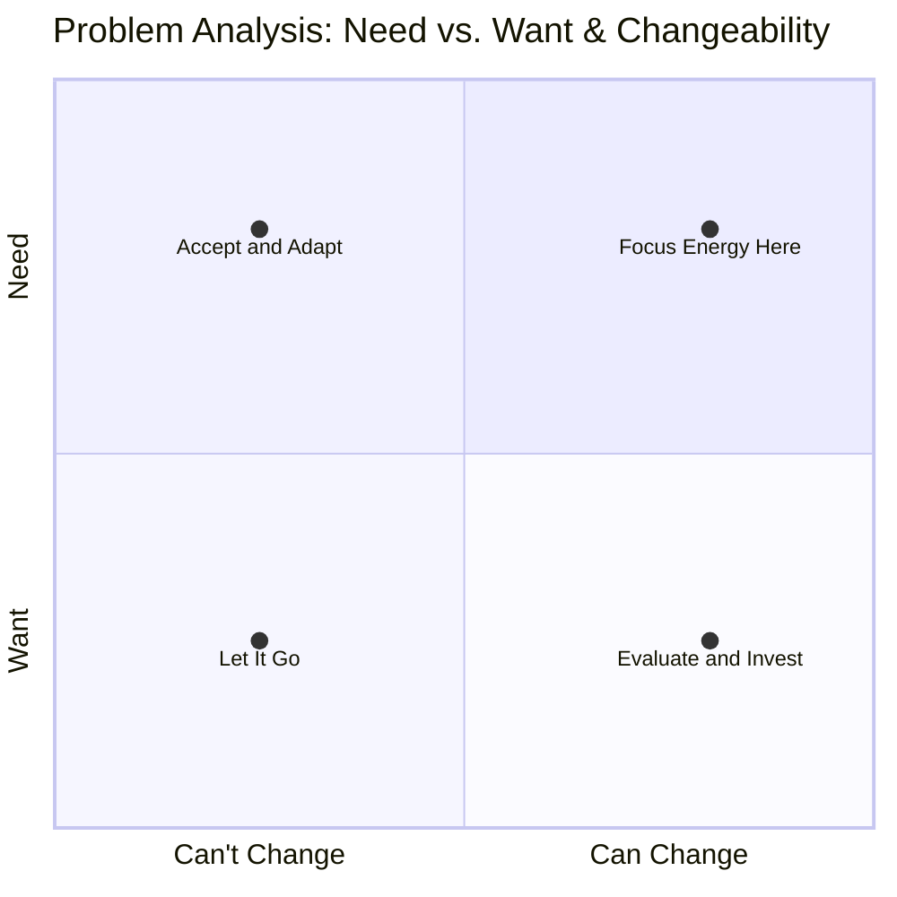

!!! reference "workflow/ is a folder fulll of the best tools"

    Workflow is a folder of reusable tools, including command line automation, task tracking, and online or offline collaboration features, designed to streamline personal or professional projects, keep things organized, and leave a clear trail for others to follow.

## need vs want

- krishnamurti defined intelligence as knowing a need from a want
- this is big let that sink in

## the kekule problem

- our unconscious mind is a machine for operating an animal
- <https://en.wikipedia.org/wiki/The_Kekul%C3%A9_Problem>

## complexity science

- <https://www.santafe.edu/what-is-complex-systems-science>

## screencast

- this is old I need to make a new one!

<iframe width="1109" height="693" src="https://www.youtube.com/embed/dXGJCCor0xU" title="shanenull.com/workflow application template demo" frameborder="0" allow="accelerometer; autoplay; clipboard-write; encrypted-media; gyroscope; picture-in-picture; web-share" allowfullscreen></iframe>

## workflow template

[get setup](setup.md){ .md-button } [deploy this template](deploy.md){ .md-button } [update this template](update.md){ .md-button }

[first principles](first.md){ .md-button }
[workflow](workflow.md){ .md-button }
[projects](projects.md){ .md-button }
[cucumber](behave.md){ .md-button }
[cookiecutter](cookiecutter.md.md){ .md-button }
[tasks](todo.md){ .md-button }
[bujo](bujo/2023.md){ .md-button }

!!! reference "sites"

    [home](https://shane0.github.io){ .md-button }
    [buddhism](https://shane0.github.io/buddhism/){ .md-button }
    [cheatsheets](https://shane0.github.io/cheatsheets/){ .md-button }
    [retro games](https://shane0.github.io/adventure/){ .md-button }

[TAGS]
