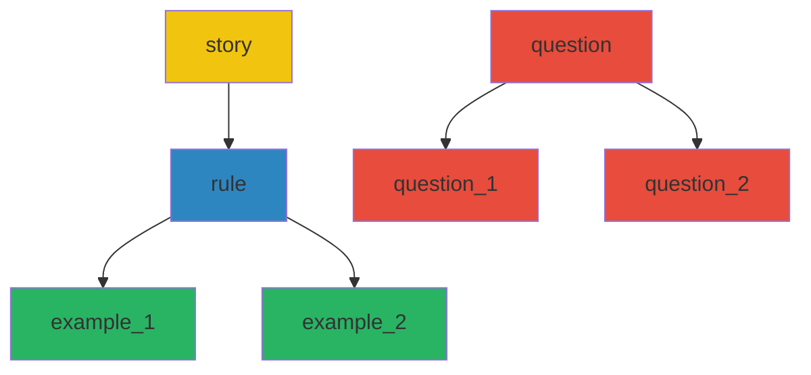

---
tags:
  - mermaid
---
# mermaid

- mermaid charts
- <https://github.com/mermaid-js/mermaid-cli>

## color fill example

graph TD
story --> rule
rule --> example_1
rule --> example_2
question --> question_1
question --> question_2
style question fill:#e74c3c
style question_1 fill:#e74c3c
style question_2 fill:#e74c3c
style story fill:#f1c40f
style rule fill: #2e86c1
style example_1 fill: #28b463
style example_2 fill: #28b463
