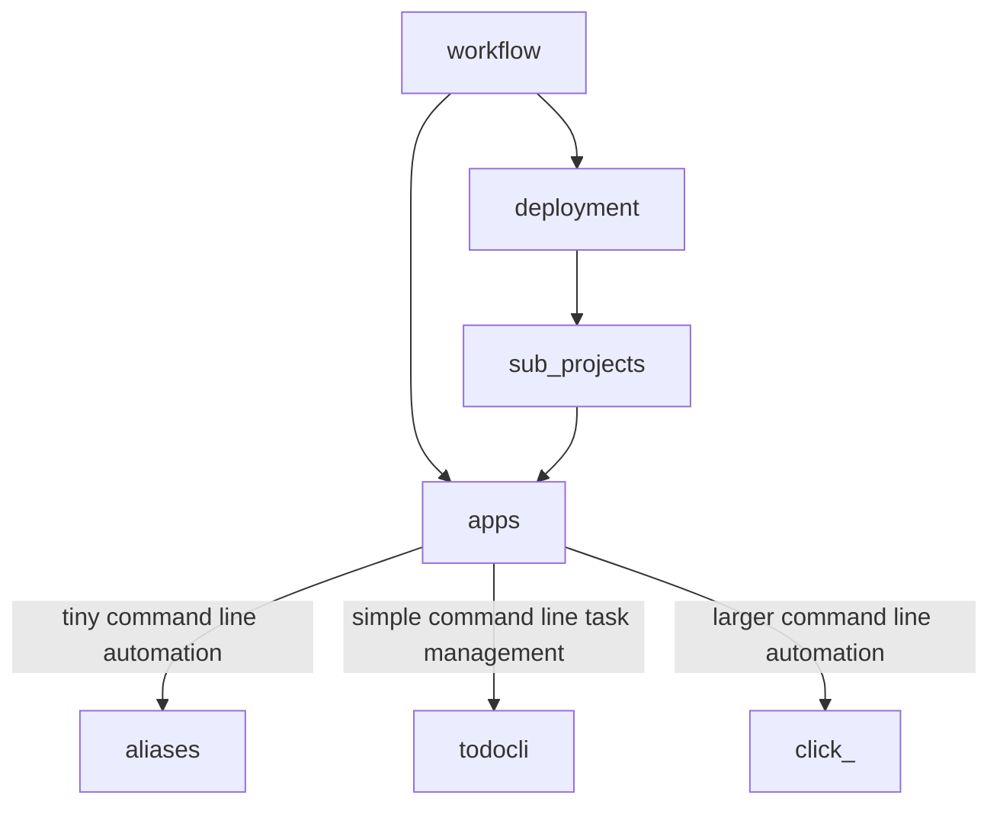

# workflow

- this file is `docs/workflow.md`
- a workflow file gets you or someone else directly to the exit using the shortest path
- when interrupted from a project workflow is a partial breadcrumb trail so you can pickup where you were quickly
- a workflow allows something to move toward automation and eliminates repition
- what I usually put here is instructions for managing data in this folder itself
- this is optional use it however you see fit
- a workflow might involve these other pages
- `docs/project.md` 
- `docs/todo.md` 
- `docs/troubleshooting.md` 
- if you create a sub project do not put it here - it should have its own `workflow.md`

## workflow for this repo

- there are two workflows each has a button on the homepage
- deploying this workflow template
- updating the template itself which is this repo
- the actual cookiecutter template is this folder: `{{cookiecutter.proj_name}}`
- on my laptop I have this cloned so from a terminal i just type

```sh
code workflow/
# make changes and push with
./push.sh
# that script directs you in the prompt for the rest
# that script opens the url to this repo
```

## optional stuff included

- this template includes a few pages that are optional
- [tasks](todo.md)
- [project folders](projects.md)
- [click automations](click.md)

- later if you return to a project you should be able to read this workflow page and pick up where you left off on your project
- what the purpose of this folder is to begin with
- what file you were creating or updating
- where it is at on your computer or the cloud etc.
- this page is optional if you are on a simple task or project just use [todo](todo.md)
- sometimes you end up in your own or someone's elses mess



```text
index.md

# optional
todo.md
projects.md
workflow.md

# automations
click.md
utils/bash_aliases
```
