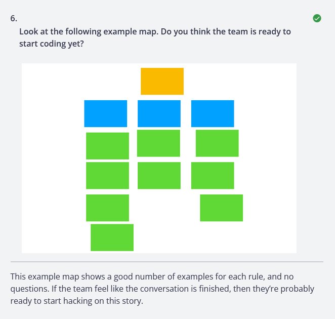

# workflow

## three amigos

- the three amigos are from business dev & test
- map it out


- good to go



- slice up the story

- someone is missing or not answering questions

- finish the story


## mermaid template


### running tests

- run your test

```sh
behave
```

- Rule docs: <https://cucumber.io/docs/gherkin/reference/?sbsearch=Rule#rule>
- <https://behave.readthedocs.io/en/latest/>
- this folder was deployed using [cookiecutter](https://cookiecutter.readthedocs.io/en/stable/)
- to update this template use the `rule/` folder at <https://github.com/shane0/workflow>
- see docs/workflow.md in docs/
- or use the local mkdocs server <https://squidfunk.github.io/mkdocs-material/>
- start the server
- it runs at <http://127.0.0.1:3000/>

```sh
mkdocs serve
```
